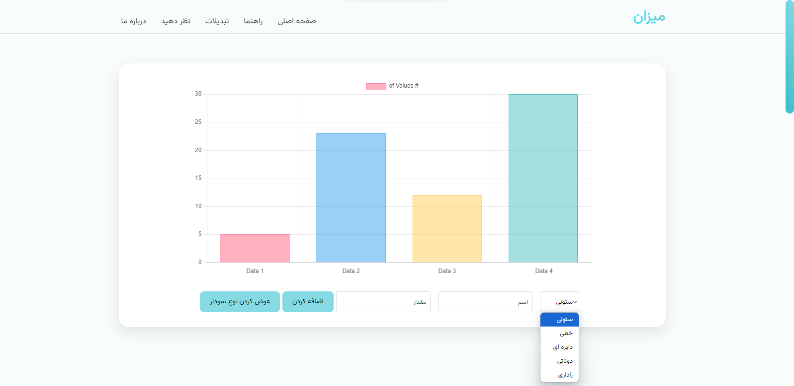

# Mizan

## About the Project
Mizan is a webiste abt converting different units of measurement. It has an important role and makes our daily work so much easier. Mizan contains 7 important main measurement units and 3 useful abilities.  
I've used Html Css Js for this project and it's my first real project(year ago) since i started my carrier.  

## Mizan's units
- Length
- Area
- Speed
- Temperature
- Pressure
- Volume
- Mass

## Mizan's special abilities
- Bmi(Body Mass Index)
- Different kinds of charts(Column,Scatter,Pie,Circle,Radar) 
- Age calculator

## Screenshots
 

## Made By Seyed Ali Najafi
- [Live Website](https://mizan-app.ir)  
- [Portfolio](https://seyedalinajafi.ir)

